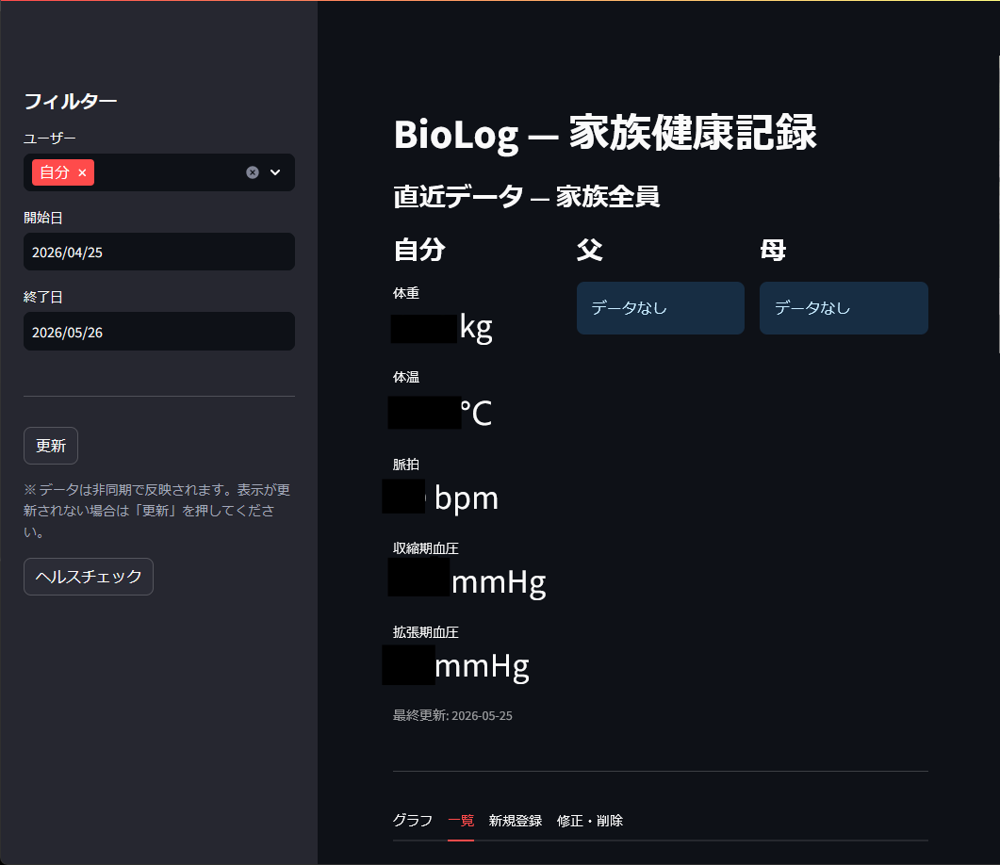
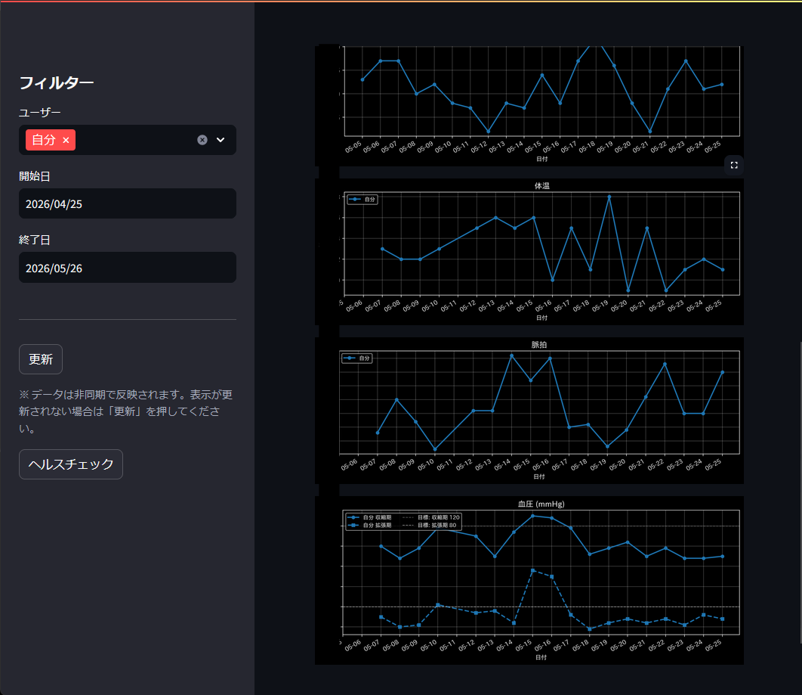
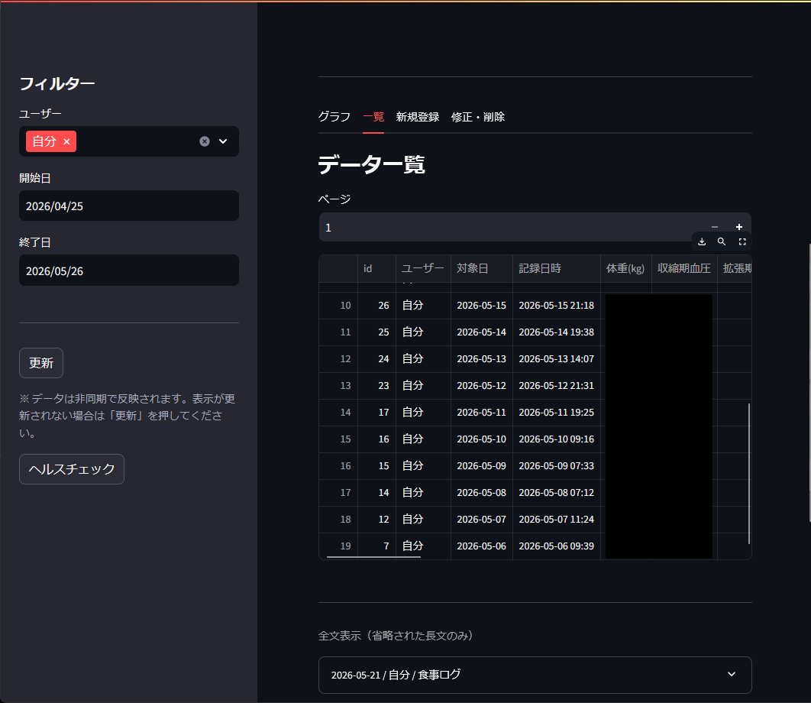

# BioLog

> Personal & family health record tracker.
> Streamlit + FastAPI + SQLite, self-hosted, **localhost-only by default**.



家族（自分・父・母など）の体温・血圧・脈拍・体重・体脂肪・食事ログ・行動ログを
日次で記録・可視化するための個人向けセルフホストアプリです。
SQLite ファイル 1 つで完結し、標準構成では外部サービスへ健康記録を送信しません。

[](LICENSE)
[](https://www.python.org)
[](https://www.docker.com)

---

## ⚠ Security Notice — Please Read First

標準ComposeはBiolog APIの`8766`とUIの`8501`を`127.0.0.1`だけに公開し、**同一PCからの利用**を前提としています。家族別の記録を管理できますが、家族の別端末からのLANアクセスは標準では有効になりません。
インターネット公開を想定していません。以下は **意図的に未実装** です：

- 認証（API キー / Basic 認証 / OAuth）**なし**
- ブラウザのクロスオリジンAPI利用（CORS許可なし）
- HTTPS / TLS **前提としていない**
- レート制限 **なし**

**標準のlocalhost限定を解除したまま、インターネットへ直接公開してはいけません。** LAN内の別端末から利用する場合も、ファイアウォール等で接続元を制限してください。クラウド VM 等で運用する場合は、Reverse proxy + 認証層（Cloudflare Access / Tailscale / Basic 認証等）を必ず前段に置いてください。

### データの保管場所

すべてのデータはローカルの SQLite ファイル（デフォルト `./data/biolog.db`）に保存されます。
標準構成では、健康記録を外部サーバへ送信しません。

---

## 主な機能

- 家族メンバー（self / father / mother）ごとの健康データを日次記録
- 体温・脈拍・血圧（収縮期/拡張期）・体重・体脂肪率・筋肉量・基礎代謝
- 食事ログ / 行動ログ / メモ（長文可、一覧で expander 展開）
- 時系列グラフ（matplotlib、複数ユーザー比較）
- CSV エクスポート（UTF-8 BOM 付き、Excel 文字化けなし）
- JST 基準の日付補完（Docker UTC 環境でも正しく動作）
- migration 機構（CREATE TABLE + ALTER 併存で新規/既存両環境対応）

---

## Screenshots

<table>
  <tr>
    <td></td>
    <td></td>
  </tr>
  <tr>
    <td align="center">時系列グラフ</td>
    <td align="center">一覧 + 全文 expander</td>
  </tr>
</table>

> ※ スクリーンショットの数値はすべてダミーデータです

---

## System Requirements

- **Docker Desktop** または **Docker Engine + Compose v2**（必須）
- 動作確認 OS: **Windows 11 + Docker Desktop**
  - Linux / macOS は理論上動作するが **未検証**
- ディスク: 約 **1 GB**（image + DB）
- メモリ: 2 GB 程度で十分
- ブラウザ: モダンなもの（Chrome / Edge / Firefox / Safari）

### Docker image / build 時間の目安

| 項目 | 目安 |
|---|---|
| 初回 build | 3〜5 分（依存パッケージ download 時間込み） |
| 2 回目以降 | 数十秒（layer cache が効く） |
| image 合計サイズ | 約 800 MB〜1 GB（biolog-api + biolog-streamlit） |

依存は軽量（FastAPI / Streamlit / matplotlib / pandas / requests）。
GPU / CUDA / ML フレームワークは **使用しません**。

---

## Quick Start

> Docker と git の基本操作に慣れていることを前提とします。

### 1. Clone

```bash
git clone https://github.com/shinosan1/biolog.git
cd biolog
```

### 2. 環境変数（任意）

デフォルトでは `./data` ディレクトリに DB が作られます。
別の場所に置きたい場合のみ `.env` を作成：

```bash
cp .env.sample .env
# エディタで BIOLOG_DATA_DIR を編集
```

### 3. 起動

```bash
docker compose up -d --build
```

初回のみ image build に 3〜5 分かかります。

### 4. アクセス

ブラウザで http://localhost:8501

ヘルスチェック：
```bash
curl http://localhost:8766/api/health/health
# {"status":"ok","db":"/data/biolog.db"}
```

### 5. 停止

```bash
docker compose down
```

DB ファイルは `${BIOLOG_DATA_DIR:-./data}/biolog.db` に永続化されているので、
`docker compose down` してもデータは残ります。

---

## Architecture

```
┌────────────────────┐    HTTP     ┌──────────────────┐
│ Streamlit (8501)   │ ──────────► │ FastAPI (8766)   │
│ - UI               │             │ - POST/PUT/DELETE│
│ - 読み取り cache   │             │ - GET (biocore)  │
└────────────────────┘             └──────┬───────────┘
                                          │ Queue
                                          ▼
                                  ┌──────────────────┐
                                  │ Worker (1 thread)│
                                  │ - 単一 Writer    │
                                  │ - UPSERT/UPDATE/ │
                                  │   DELETE         │
                                  └──────┬───────────┘
                                         │ db_manager
                                         ▼
                                  ┌──────────────────┐
                                  │ SQLite           │
                                  │ /data/biolog.db  │
                                  └──────────────────┘
```

詳細は [仕様書](biolog_streamlit/仕様書.md) を参照。

---

## Design Rationale

### Why SQLite?

| 観点 | 理由 |
|---|---|
| **デプロイ簡易性** | ファイル 1 つ。バックアップは `cp` だけ |
| **依存最小** | 別 DB サーバ不要、Docker compose が biolog-api + biolog-streamlit のみで完結 |
| **個人/家族規模で十分** | レコード数は年間数千件程度。リクエスト頻度も 1 秒に 1 件未満 |
| **WAL 不要設計** | Windows + NTFS bind mount で WAL モードが I/O エラーを誘発するため、`PRAGMA journal_mode=DELETE` を強制 |

### Concurrency Model（単一 Writer）

書き込みは **1 本の Worker スレッド** に集約しています：

```
HTTP Request → FastAPI → Queue → Worker (1) → db_manager → SQLite
```

これにより：
- `database is locked` エラーを **構造的に回避**
- リトライロジックを worker.py の 1 箇所に集約
- BEGIN IMMEDIATE / commit / rollback のトランザクション境界が明確

### Cache Invalidation

`@st.cache_data` は読み取りキャッシュとして使用。書き込み成功時に
`fetch_latest.clear()` / `fetch_range_data.clear()` で per-function に明示 invalidate。
セッション跨ぎでも古いキャッシュキーに衝突しない設計
（v1.5.5 で version 機構を廃止）。

---

## Not For（このアプリは○○には向きません）

- ❌ **インターネット公開**（認証・TLS・レート制限なし）
- ❌ **同時 100+ ユーザー**（単一 Writer、SQLite ファイル）
- ❌ **数百万件のデータ**（SQLite で動くが、グラフ描画が重くなる）
- ❌ **リアルタイム性が必要なユースケース**（Eventual Consistency 設計、書き込みから表示まで数秒）
- ❌ **マルチテナント / 不特定多数のユーザー**（user_id は固定 3 種：self / father / mother）

## 2026-07-27 安定性・監査対応

- Worker内の各書き込みタスクを例外隔離し、レコード不在や不正タスクで
  単一Writerスレッド全体が停止しないようにした。
- Worker応答が30秒以内に返らない場合は、未処理の500ではなく503を返す。
- API healthはWorker生存、DB読取疎通、Queue使用量を返す。
  Docker Composeのhealthcheckは状態の可視化用であり、`unhealthy`だけでは
  コンテナは自動再起動されない。
- 一覧とCSVは、指定期間および選択ユーザーだけを対象とする。
  CSVは現在ページではなく指定範囲の全件を出力する。
- SQLiteは`journal_mode=DELETE`を維持し、有限のbusy timeoutと短い読取リトライを使う。
- APIはページング負値、不正日付、逆転期間、JSONオブジェクト以外、
  過大なテキストを拒否する。`preprocess.py`の既存の整数型補正は維持する。
- コンテナ時刻は`Asia/Tokyo`へ統一し、Streamlit利用統計を無効化した。
- CSVの文字列が`=`, `+`, `-`, `@`で始まる場合は、表計算ソフトで
  数式として実行されないよう無害化する。
- Linuxコンテナの追加capabilityはすべて破棄する。
- APIとStreamlitはUID/GID `10001`の非rootユーザーで実行する。
  `/data`のバインドマウントは運用反映前に書き込み権限を確認する。
- `constraints.txt`で、2026-07-27時点の動作中イメージから採取した
  推移依存パッケージの版を固定する。

Streamlitの`Cannot load Streamlit frontend code`は原因未確定である。
再発時は[NETWORK_ISSUE_DIAGNOSTICS.md](docs/NETWORK_ISSUE_DIAGNOSTICS.md)に従い、
Docker再起動前にブラウザ、HTTP、コンテナ、スリープ復帰の証拠を採取する。

これらが必要な場合は別のスタック（PostgreSQL + 認証付きフレームワーク等）を検討してください。

---

## Data Persistence

### デフォルト動作

```yaml
# docker-compose.yml
volumes:
  - ${BIOLOG_DATA_DIR:-./data}:/data
```

- 環境変数未設定なら、リポジトリ直下の `./data/` にバインドマウント
- 初回起動時に `./data/biolog.db` が **migration runner により自動生成**

### バックアップ

```bash
docker compose down                    # 安全のため停止
cp ./data/biolog.db ./backup/biolog_$(date +%Y%m%d).db
docker compose up -d
```

### 別の場所に置く

`.env` を作成：
```bash
# Windows 例
BIOLOG_DATA_DIR=D:/AI/biolog/data

# Linux 例
BIOLOG_DATA_DIR=/var/lib/biolog
```

---

## Known Issues / Limitations

正直に列挙します。

### Resolved（修正済み）
- ✅ セッション跨ぎで古いキャッシュが残る問題 → v1.5.5 で version 機構廃止、per-function clear に変更
- ✅ 深夜 0〜9 時 (JST) に登録すると date が前日になる → v1.5.0 で `jst_date()` 統一
- ✅ 新規環境で `health_records` テーブル不在で起動失敗 → v1.5.2 で `CREATE TABLE IF NOT EXISTS` 追加
- ✅ migration runner の手動実行忘れ → v1.5.3 で entrypoint.sh による自動化
- ✅ 新規登録成功後もフォームに前回の入力値が残る → v1.7.6 で修正（登録成功時のみリセット、エラー時は入力を維持）
- ✅ 同一ユーザー・同一日付の再登録で API が `id=0` を返す → v1.7.6 で修正（UPSERT 後に実レコード ID を取得）

### Open（既知の未解決）
- ⚠ **migration_lock の stale 残存**：コンテナ強制終了で finally が走らないとロックが残る。手動 `DELETE FROM migration_lock WHERE id = 1` で復旧
- ⚠ **runner.py の lock 競合時 exit 0 仕様**：lock 残存時 runner は何もせず exit 0 → schema 未整備のまま API が起動する可能性あり
- ⚠ **CHECK 制約未実装**：DB レベル制約は無し、Pydantic 層のみで範囲検証している（DB 直接編集時の弱点）
- ⚠ **`updated_at` カラム未実装**：UPDATE しても created_at は変わらない。監査ログ用途には不十分

### Untested / Unverified（未検証範囲）
- 🔍 **Linux / macOS での動作**：理論上動くはずだが、Windows 以外での動作確認は未実施
- 🔍 **大量データ（数万件以上）**：性能未測定、グラフ描画速度に影響する可能性
- 🔍 **長時間連続稼働**：数ヶ月レベルの常時稼働は未検証
- 🔍 **マルチアーキテクチャ image**：amd64 でのみ確認済み、arm64 未検証
- 🔍 **同一データに対する複数 Streamlit インスタンス**：cache が分離するため、別タブで編集 → 別タブで未反映の可能性

### Out of Scope（対応予定なし）
- ❌ マルチユーザー認証
- ❌ クラウド DB 対応
- ❌ モバイルアプリ
- ❌ 機械学習による予測

---

## Troubleshooting

### Streamlit が起動しない / SyntaxError
```bash
docker logs biolog-streamlit --tail 50
```
ファイル編集ミスが最有力。差し戻して再起動：
```bash
docker compose restart biolog-streamlit
```

### API ヘルスチェックが失敗
```bash
docker logs biolog-api --tail 50
curl http://localhost:8766/api/health/health
```

### 「Migration lock exists」で API が起動しない
```bash
docker exec biolog-api python -c "
import sqlite3
conn = sqlite3.connect('/data/biolog.db')
conn.execute('DELETE FROM migration_lock WHERE id = 1')
conn.commit()
conn.close()
print('Lock released')
"
docker compose restart biolog-api
```

### `database is locked` が頻発
- WAL モード残骸を確認：`./data/biolog.db-wal` / `./data/biolog.db-shm` ファイルがあれば削除
- WAL モードは `db_manager.py` で禁止しているが、過去に手動 PRAGMA を実行した場合は残ることがある

### 表示が古い
- サイドバー「更新」ボタンを押す
- ブラウザを完全リロード（Ctrl + F5）

### ポート競合
- biolog-api: 8766、biolog-streamlit: 8501
- 他で使用中なら `docker-compose.override.yml` で port を変更

---

## Contributing

このリポジトリは個人プロジェクトのため、Pull Request の対応保証はありません。
ただし以下は歓迎します：

- バグ報告（再現手順を添えて Issues へ）
- ドキュメントの誤字修正
- known issues に挙げた項目の修正提案

設計上の変更（DB スキーマ・認証導入・アーキテクチャ刷新等）は
Issues で **設計議論を先に** お願いします。実装 PR を直接送らないでください。

---

## Roadmap（参考）

監査由来の未着手タスク：
- M1: `schemas.py` の date に `YYYY-MM-DD` 形式バリデータ追加
- M2: API queue.Empty を 504 Gateway Timeout で返却
- L1: biocore.py の `SELECT *` を明示列指定に置換

優先度は低く、現状で実害なし。

---

## ドキュメント

| ファイル | 内容 |
|---|---|
| [CHANGELOG.md](CHANGELOG.md) | バージョン履歴 |
| [biolog_streamlit/仕様書.md](biolog_streamlit/仕様書.md) | アーキテクチャ・データフロー・整合性モデル |
| [biolog_streamlit/操作説明書.md](biolog_streamlit/操作説明書.md) | 画面操作手順 |
| [biolog_api/skills.md](biolog_api/skills.md) | API リファレンス（curl 集） |
| [PRIVACY_POLICY.md](PRIVACY_POLICY.md) | プライバシーポリシー |
| [TERMS_OF_SERVICE.md](TERMS_OF_SERVICE.md) | 利用規約 |

---

## License

[MIT License](LICENSE) © 2026 [shinosan1]

---

## Acknowledgments

- 設計議論・実装の一部は Claude Code (Anthropic) を併用しています
